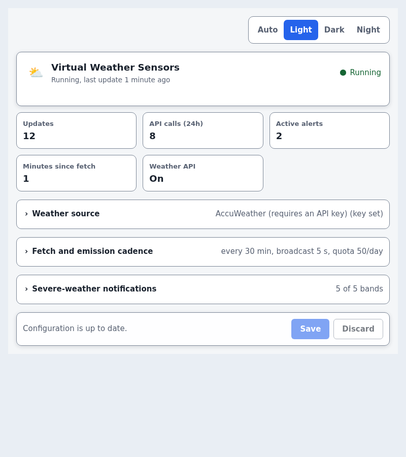
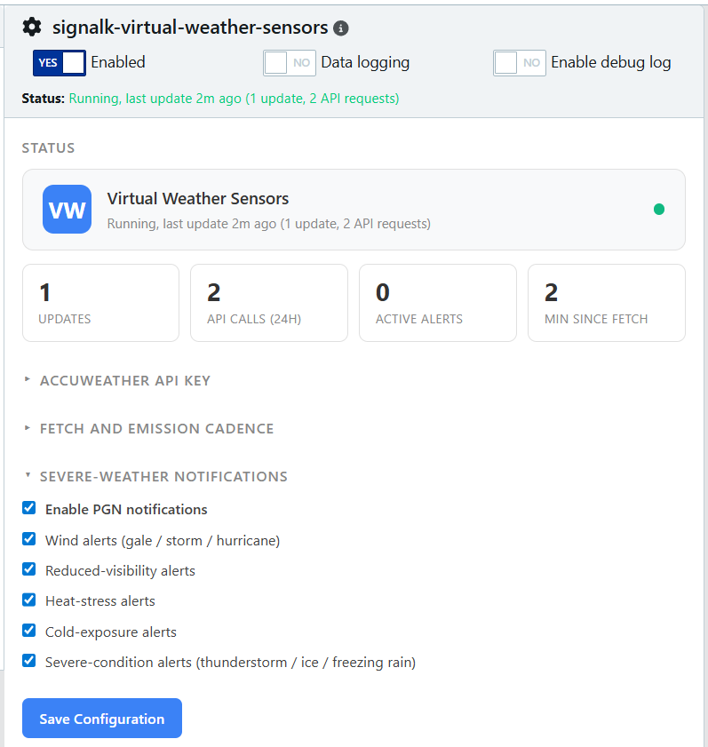
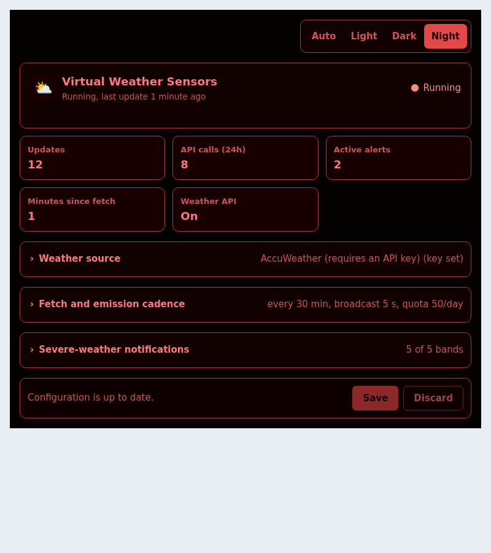

# Virtual Weather Sensors

[](https://www.npmjs.com/package/signalk-virtual-weather-sensors)
[](https://www.npmjs.com/package/signalk-virtual-weather-sensors)
[](https://github.com/NearlCrews/signalk-virtual-weather-sensors/actions/workflows/ci.yml)
[](https://github.com/NearlCrews/signalk-virtual-weather-sensors/blob/main/LICENSE)
[](https://nodejs.org)
[](https://www.buymeacoffee.com/nearlcrews)

A virtual weather station for [Signal K](https://signalk.org): it fetches
weather conditions for the vessel's current position and publishes them
as 30+ Signal K environment deltas, with severe-weather notifications, a
Signal K v2 Weather API forecast provider, and NMEA2000-ready path alignment.
It works out of the box with the free, keyless [Open-Meteo](https://open-meteo.com)
service; AccuWeather is an optional source for users who have an API key.

> The weather data and the notifications are advisory. They are not certified
> for safety-of-life decisions: always cross-check official forecasts and
> warnings against your primary instruments.

## What's new in 1.9.0

A keyless, global weather source so the plugin works out of the box.
AccuWeather retired its permanent free tier, so the plugin no longer depends on it.

- **Open-Meteo is the new default source**, free and keyless: a fresh install
  fetches global weather with no API key and no signup.
- **AccuWeather is now optional.** It stays available for its exclusive fields
  (RealFeel, plain-language text, pressure tendency, precipitation type) when you
  enter a key, and existing AccuWeather installs are preserved unchanged on upgrade.
- **Pick the source in the config panel**, with a configurable Open-Meteo endpoint
  so commercial users can self-host or use a paid plan.
- **Per-provider `$source`** so consumers can set source priorities: Open-Meteo
  data carries `$source: 'open-meteo'`, AccuWeather keeps `accuweather`.

Open-Meteo provides fewer fields than AccuWeather (no RealFeel or measured
wet-bulb globe temperature, for example; the plugin estimates the heat-stress
index instead). See the [v1.9.0 changelog entry](CHANGELOG.md#v190), or the
[changelog](CHANGELOG.md) for the full list.

## What it does

Signal K is an open marine data standard that streams a boat's navigation,
environment, and AIS data over a single API. Virtual Weather Sensors is a
Signal K server plugin that fills the environment branch on boats without a
masthead weather station: it polls a weather API (keyless Open-Meteo by
default, or AccuWeather with a key) for conditions at the vessel's GPS
position and emits them as standard Signal K deltas that instrument panels,
dashboards, and NMEA2000 bridges consume natively.

Every delta carries a provider `$source` (`open-meteo` or `accuweather`), so a
boat that later gains a real anemometer or barometer can prefer the physical
sensor through Signal K source priorities. With an AccuWeather key the plugin
also registers as a Signal K v2 Weather API provider, serving hourly and daily
forecasts over REST, and either source can raise opt-in severe-weather
notifications for wind, visibility, heat, cold, and severe conditions.

## Features

- **30+ weather data points.** Temperatures, wind, pressure, humidity, UV,
  visibility, cloud cover, pressure tendency, precipitation type, visibility
  obstruction, and a plain-language condition summary.
- **Spec-compliant Signal K paths.** Canonical Signal K 1.8.2 leaves under
  `environment.outside.*` and `environment.wind.*`, with AccuWeather
  extensions and derived values on a producer-namespaced
  `environment.weather.*` branch.
- **Signal K v2 Weather API provider.** Serves AccuWeather forecasts at
  `/signalk/v2/api/weather/forecasts/point` and `.../forecasts/daily`, so
  dashboards such as [Binnacle](https://github.com/NearlCrews/signalk-binnacle)
  can show forecast data.
- **Apparent wind calculated** from the true wind and the vessel's own
  motion, published on the producer-namespaced branch so it never displaces
  a real anemometer.
- **Severe-weather notifications** (opt-in, off by default) for wind,
  visibility, heat, cold, and severe conditions, with actionable context in
  every message.
- **React configuration panel** in the admin UI with a live status
  dashboard, an inline API key test, unsaved-changes tracking, and light,
  dark, and night-red themes, with a JSON-schema form fallback for older
  admin UIs.
- **NMEA2000 path alignment** for bridging onto a physical bus via a
  companion emitter plugin.
- **`$source: 'accuweather'` on every delta**, so real onboard sensors can
  win on source priority.

## Screenshots

The configuration panel in the Signal K admin UI, with a live status card
showing update count, rolling 24-hour API usage, active alerts, and minutes
since the last fetch.

| Status dashboard | Notification toggles | Night-red theme |
| --- | --- | --- |
| [](assets/screenshots/config-panel-status.png) | [](assets/screenshots/config-panel-notifications.png) | [](assets/screenshots/config-panel-night.png) |

## Requirements

- [Signal K server](https://github.com/SignalK/signalk-server) 2.x. The
  Weather API forecast provider needs a server shipping
  `@signalk/server-api` 2.24 or newer; on older 2.x servers the plugin
  still runs and skips the provider registration.
- Node.js 20.18 or newer.
- A free AccuWeather API key from
  [developer.accuweather.com](https://developer.accuweather.com/).
- A GPS position published on `navigation.position` (the plugin queries
  AccuWeather for the vessel's current location).
- The configuration panel needs Signal K admin UI 2.27.0 or newer. On older
  servers the plugin still works and falls back to the standard settings
  form.

## Installation

Install from the Signal K admin UI under **Appstore, then Available**, or
from npm:

```bash
cd ~/.signalk
npm install signalk-virtual-weather-sensors
```

From source:

```bash
git clone https://github.com/NearlCrews/signalk-virtual-weather-sensors.git
cd signalk-virtual-weather-sensors
npm install
npm run build
ln -s "$(pwd)" ~/.signalk/node_modules/signalk-virtual-weather-sensors
```

## Configuration

In the Signal K admin UI, open **Server, then Plugin Config**, find
"Virtual Weather Sensors", and enable the plugin.

| Setting | Description | Default | Range |
|---------|-------------|---------|-------|
| AccuWeather API Key | Required. Free key from AccuWeather. | n/a | n/a |
| Weather Update Frequency | Minutes between weather fetches. The default 30 uses 48 calls/day, inside the free-tier 50/day cap. | 30 | 1 to 60 |
| Broadcast Interval | Seconds between delta re-emissions, so NMEA2000 listeners keep seeing fresh deltas. | 5 | 1 to 60 |
| Daily API Call Quota | Cap on AccuWeather calls per rolling 24-hour window. 0 disables the cap. | 50 | 0 to 1000 |
| Severe-weather notifications | Master toggle plus per-category sub-toggles (wind, visibility, heat, cold, severe conditions). | master off, sub-toggles on | boolean |

## What it emits

The plugin emits 30+ data points under three namespaces: canonical
`environment.outside.*` and `environment.wind.*` paths from the Signal K
1.8.2 vocabulary, plus a producer-namespaced `environment.weather.*` branch
for AccuWeather extensions and plugin-derived values (Beaufort scale, heat
stress, pressure tendency, precipitation type, visibility obstruction, a
plain-language condition summary, and more). A one-shot meta delta on start
describes units and labels for the non-canonical paths.

See [docs/signal-k-paths.md](docs/signal-k-paths.md) for the full path, PGN,
and notification reference.

## NMEA2000 integration

This plugin outputs Signal K deltas only. To bridge them onto a physical
NMEA2000 bus, pair it with an emitter plugin such as
[`signalk-nmea2000-emitter-cannon`](https://github.com/NearlCrews/signalk-nmea2000-emitter-cannon),
which covers PGNs 130306 (wind), 130312 and 130316 (temperatures), 130313
(humidity), and 130314 (pressure). See
[docs/signal-k-paths.md](docs/signal-k-paths.md#nmea2000-pgn-coverage) for
the per-PGN path mapping.

## Weather API provider

The plugin registers as a Signal K v2 Weather API provider, so consumers can
pull forecasts over REST instead of subscribing to the delta stream:

- `GET /signalk/v2/api/weather/forecasts/point` returns hourly point
  forecasts (from the AccuWeather 12-hour hourly source).
- `GET /signalk/v2/api/weather/forecasts/daily` returns daily forecasts
  (from the AccuWeather 5-day source).

Registering the provider is what makes the server list `weather` under
`/signalk/v2/features`, which is how dashboards such as
[Binnacle](https://github.com/NearlCrews/signalk-binnacle) detect that
forecast support is available. Forecasts are mapped to SI units, cached on
demand, and share the plugin's rolling 24-hour API quota so a polling client
cannot exhaust a free key. Observations and warnings are not served yet. See
[docs/signal-k-paths.md](docs/signal-k-paths.md#weather-api-provider) for
the populated field reference.

## Notifications

Severe-weather notifications under `notifications.environment.*` are opt-in
and off by default. When enabled, the plugin emits one Signal K notification
per hazard band transition (entry and exit) across wind, visibility, heat,
cold, and severe-condition categories. Each message packs actionable context
(for example `Gale-force wind: Bf9 from SW, 19 m/s, gusts 27 m/s, 998 hPa`).
Bridging to NMEA 2000 Alert PGNs requires the separate `signalk-to-nmea2000`
plugin. See [docs/signal-k-paths.md](docs/signal-k-paths.md#notifications)
for the full band, trigger, and message reference.

## Troubleshooting

Common issues, shown as a status banner in the admin UI:

- **Invalid API key (HTTP 401)**: re-copy the key from AccuWeather with no
  surrounding whitespace.
- **Rate limit or quota reached**: raise the update frequency interval or
  the daily quota; the free tier allows 50 calls/day.
- **No position available**: confirm a GPS source publishes
  `navigation.position` in the Data Browser.

See [docs/troubleshooting.md](docs/troubleshooting.md) for the full guide.

## Documentation

- [Signal K paths, PGNs, and notifications](docs/signal-k-paths.md)
- [Troubleshooting](docs/troubleshooting.md)
- [Development guide](docs/DEVELOPMENT.md)
- [Changelog](CHANGELOG.md)
- [Contributing](.github/CONTRIBUTING.md)
- [Security policy](.github/SECURITY.md)

## Development

This project targets Node 20.18 or newer and develops against
`@signalk/server-api` 2.24 or newer, with TypeScript 6 (development only).

```bash
git clone https://github.com/NearlCrews/signalk-virtual-weather-sensors.git
cd signalk-virtual-weather-sensors
npm install          # install dependencies
npm run build        # compile the plugin and bundle the config panel
npm test             # Vitest suite, single run
npm run type-check   # type-check the plugin and the panel
npm run lint         # Biome check
npm run lint:fix     # lint and auto-fix
npm run validate     # type-check, lint, and tests in one pass
```

Run `npm run validate` before committing. See the
[development guide](docs/DEVELOPMENT.md) for the full workflow, and
[CONTRIBUTING.md](.github/CONTRIBUTING.md) for the pull request process. By
taking part you agree to the
[Code of Conduct](.github/CODE_OF_CONDUCT.md).

## License

Apache-2.0: see [LICENSE](LICENSE) for the full text. The software is
provided "AS IS", without warranty of any kind. Treat the weather data and
the notifications as advisory, and always carry independent means of
forecasting and navigation.

## Acknowledgments

Virtual Weather Sensors is written and maintained by
[Nearl Crews](https://github.com/NearlCrews).

- [Signal K Project](https://signalk.org/) for the open marine data
  standard
- [AccuWeather](https://developer.accuweather.com/) for the weather API
  this plugin polls

Virtual Weather Sensors pairs well with sibling plugins such as
[`signalk-nmea2000-emitter-cannon`](https://github.com/NearlCrews/signalk-nmea2000-emitter-cannon)
and [`signalk-binnacle`](https://github.com/NearlCrews/signalk-binnacle).

## Support

Find this plugin useful? You can support its continued development by
[buying me a coffee](https://www.buymeacoffee.com/nearlcrews).

- [Report a bug](https://github.com/NearlCrews/signalk-virtual-weather-sensors/issues/new?template=bug_report.yml)
- [Request a feature](https://github.com/NearlCrews/signalk-virtual-weather-sensors/issues/new?template=feature_request.yml)
- [Security issues](.github/SECURITY.md)
