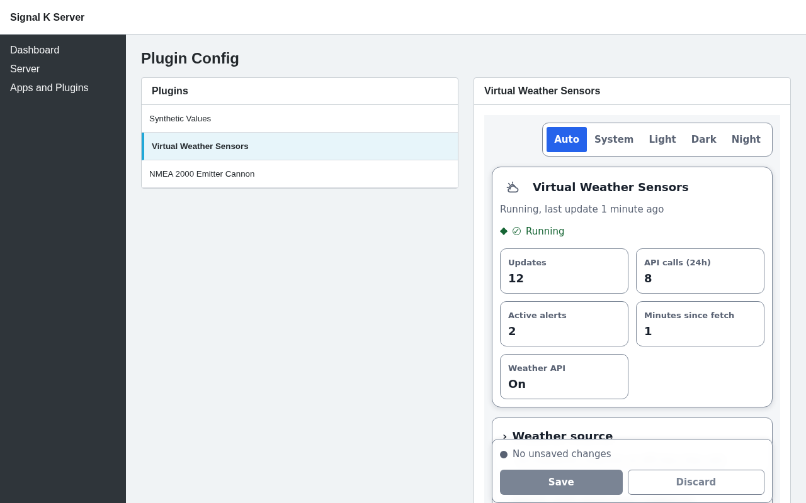
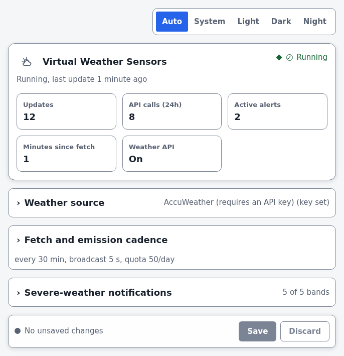
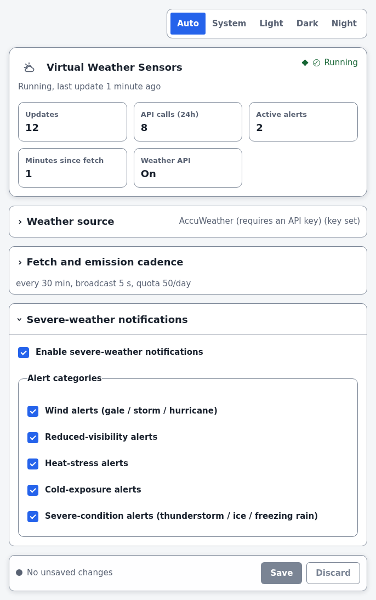
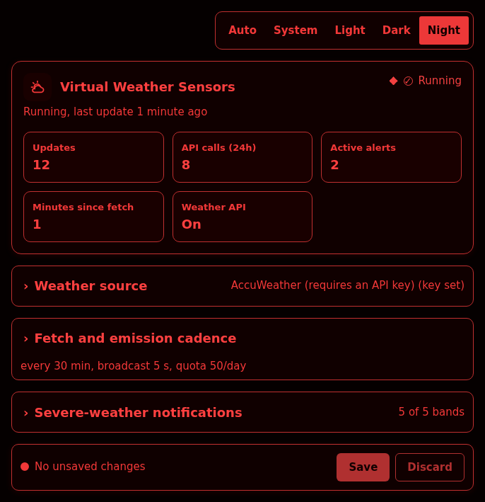

# Virtual Weather Sensors

[](https://www.npmjs.com/package/signalk-virtual-weather-sensors)
[](https://www.npmjs.com/package/signalk-virtual-weather-sensors)
[](https://github.com/NearlCrews/signalk-virtual-weather-sensors/actions/workflows/ci.yml)
[](https://github.com/NearlCrews/signalk-virtual-weather-sensors/blob/main/LICENSE)
[](https://nodejs.org)
[](https://www.buymeacoffee.com/nearlcrews)

A virtual weather station for [Signal K](https://signalk.org): it fetches
weather conditions for the vessel's current position and publishes them
as 30+ Signal K environment deltas, with severe-weather notifications, a
Signal K v2 Weather API forecast provider, and NMEA2000-ready path alignment.
It works out of the box with the free, keyless [Open-Meteo](https://open-meteo.com)
service; AccuWeather is an optional source for users who have an API key.

> The weather data and the notifications are advisory. They are not certified
> for safety-of-life decisions: always cross-check official forecasts and
> warnings against your primary instruments.

## What's new in 1.13.5

Version 1.13.5 stops the configuration panel from discarding work when a
section is collapsed, corrects a Met.no observation value, and refreshes the
shared panel. Emitted paths and saved configuration fields are unchanged.

- **Collapsed sections keep your edits.** Collapsing and reopening the cadence
  section no longer throws away an in-progress value or clears its error, and
  an invalid entry keeps blocking Save until you fix or discard it.
- **The API-key test always recovers.** Collapsing the weather-source section
  mid-test no longer strands the Test button in its testing state.
- **Honest Met.no observations.** Met.no publishes precipitation only for the
  hour ahead, so the Signal K v2 Weather API no longer reports that forecast as
  an observed past-hour amount.
- **Shared marine UI 0.8.2.** The panel's action bar now delivers the first
  click reliably and settles its docking, every button meets the touch-target
  size for your pointer, and the theme follows a section you reopen. Verified
  across Chromium, Firefox, WebKit, and a mobile viewport.
- **Clearer packaging.** The package now ships third-party notices generated
  from the panel's actual bundle, verified on every packaging run.

See the [v1.13.5 changelog entry](https://github.com/NearlCrews/signalk-virtual-weather-sensors/blob/main/CHANGELOG.md#v1135), or the
[full changelog](https://github.com/NearlCrews/signalk-virtual-weather-sensors/blob/main/CHANGELOG.md).

## What it does

Signal K is an open marine data standard that streams a boat's navigation,
environment, and AIS data over a single API. Virtual Weather Sensors is a
Signal K server plugin that fills the environment branch on boats without a
masthead weather station: it polls a weather API (keyless Open-Meteo by
default, keyless Met.no, or AccuWeather with a key, or all of them blended in
merge mode) for conditions at the vessel's GPS position and emits them as
standard Signal K deltas that instrument panels, dashboards, and NMEA2000
bridges consume natively.

Every delta carries a provider `$source` (`open-meteo`, `met-no`, `accuweather`,
or `vws-merged`), so a boat that later gains a real anemometer or barometer can
prefer the physical sensor through Signal K source priorities. Any
forecast-capable source registers the plugin as a Signal K v2 Weather API
provider, serving hourly and daily forecasts over REST, and every source can
raise opt-in severe-weather notifications for wind, visibility, heat, cold, and
severe conditions.

## Features

- **30+ weather data points.** Temperatures, wind, pressure, humidity, UV,
  visibility, cloud cover, pressure tendency, precipitation type, visibility
  obstruction, and a plain-language condition summary.
- **Spec-compliant Signal K paths.** Canonical Signal K 1.8.2 leaves under
  `environment.outside.*` and `environment.wind.*`, with AccuWeather
  extensions and derived values on a producer-namespaced
  `environment.weather.*` branch.
- **Signal K v2 Weather API provider.** Any forecast-capable source (Open-Meteo,
  Met.no, or AccuWeather) serves forecasts, current observations, and
  region-aware severe-weather warnings over REST, so dashboards such as
  [Binnacle](https://github.com/NearlCrews/signalk-binnacle) can show forecast
  data.
- **Apparent wind calculated** from the true wind and the vessel's own
  motion, published on the producer-namespaced branch so it never displaces
  a real anemometer.
- **Severe-weather notifications** (opt-in, off by default) for wind,
  visibility, heat, cold, and severe conditions, with actionable context in
  every message.
- **Shared Signal K configuration panel** built with
  `signalk-nearlcrews-ui`, with a live status dashboard, an inline API key
  test, a concealed field with explicit Show and Hide controls, accessible
  validation and reordering, unsaved-change tracking, Auto and System
  preferences, and light, dark, and night-red themes. Older admin UIs retain
  the JSON-schema form fallback.
- **NMEA2000 path alignment** for bridging onto a physical bus via a
  companion emitter plugin.
- **Per-provider `$source` on every delta** (`open-meteo`, `met-no`,
  `accuweather`, `vws-merged`, or `open-meteo-marine`), so real onboard sensors can
  win on source priority.

## Screenshots

The configuration panel in the Signal K admin UI, with a live status card
showing update count, rolling 24-hour API usage, active alerts, and minutes
since the last fetch.



| Status dashboard | Notification toggles | Night-red theme |
| --- | --- | --- |
|  |  |  |

## Requirements

- [Signal K server](https://github.com/SignalK/signalk-server) 2.x. The
  Weather API forecast provider needs a server shipping
  `@signalk/server-api` 2.24 or newer; on older 2.x servers the plugin
  still runs and skips the provider registration.
- Node.js 20.18 or newer.
- No API key for the default Open-Meteo source. An AccuWeather API key from
  [developer.accuweather.com](https://developer.accuweather.com/) is optional,
  needed if you select AccuWeather as the single source or want it to
  participate in a merged source.
- A GPS position published on `navigation.position` (the plugin queries the
  active weather provider for the vessel's current location).
- The configuration panel needs Signal K admin UI 2.27.0 or newer. On older
  servers the plugin still works and falls back to the standard settings
  form. The custom panel also requires native CSS `@scope`, available in
  Chromium and Edge 118+, Firefox 146+, and Safari 17.4+.

## Installation

Install from the Signal K admin UI under **Apps and Plugins, then Store**, or
from npm:

```bash
cd ~/.signalk
npm install signalk-virtual-weather-sensors
```

From source:

```bash
git clone https://github.com/NearlCrews/signalk-virtual-weather-sensors.git
cd signalk-virtual-weather-sensors
npm ci
npm run build
ln -s "$(pwd)" ~/.signalk/node_modules/signalk-virtual-weather-sensors
```

## Configuration

In the Signal K admin UI, open **Server, then Plugin Config**, find
"Virtual Weather Sensors", and enable the plugin.

The custom panel bundles `signalk-nearlcrews-ui` but consumes the Admin host's
matching React and React DOM 19 singletons. Auto follows a published host theme
and otherwise stays Light to match current Signal K Admin. System explicitly
follows the operating-system preference; Light, Dark, and Night remain direct
choices. Night changes the plugin panel, not the surrounding Admin chrome.

The Save button requests persistence through Signal K Admin's fire-and-forget
callback, then polls and reports the current plugin status. A running response
does not prove that the void callback completed persistence, so the panel does
not claim that it does. The panel preserves unknown top-level and notification
fields when it writes known settings, keeping configurations forward compatible.

| Setting | Description | Default | Range |
|---------|-------------|---------|-------|
| Weather source | Open-Meteo (free, keyless, global), Met.no (free, keyless, global), or AccuWeather (needs a key, adds RealFeel, plain-language text, pressure tendency, and precipitation type). In merge mode this source is the primary that sets source priority and backs forecasts. | Open-Meteo | Open-Meteo, Met.no, or AccuWeather |
| Provider mode | Single source, or merge available providers into a synthetic `vws-merged` source that blends current conditions. | Single source | Single or Merge |
| AccuWeather API Key | Required when single mode selects AccuWeather. In merge mode, setting a key enables AccuWeather in the blend. The panel conceals it by default and provides explicit Show and Hide controls. | none | n/a |
| Open-Meteo base URL | Optional. Leave blank for the free public service (non-commercial use). Self-hosted or paid users can enter a custom endpoint. | none | n/a |
| Emit sea state | Adds a keyless Open-Meteo Marine layer (waves, swell, sea temperature, and current) on `environment.water.*` and `environment.current`. Coastal and offshore only. | off | boolean |
| Weather Update Frequency | Minutes between weather fetches. When AccuWeather participates, the default 30 makes 48 calls/day, within the default 50/day quota. | 30 | 1 to 60 |
| Broadcast Interval | Seconds between cached delta re-emissions for NMEA2000 listeners. The provider observation timestamp is retained. | 5 | 1 to 60 |
| Daily API Call Quota | Cap on AccuWeather calls per rolling 24-hour window whenever it participates, including merge mode. 0 disables the cap. Open-Meteo and Met.no are keyless and uncapped. | 50 | 0 to 1000 |
| Severe-weather notifications | Master toggle plus per-category sub-toggles (wind, visibility, heat, cold, severe conditions). | master off, sub-toggles on | boolean |

## What it emits

The plugin emits 30+ data points under canonical `environment.outside.*` and
`environment.wind.*` paths from the Signal K 1.8.2 vocabulary, plus a
producer-namespaced `environment.weather.*` branch for provider extensions and
plugin-derived values (Beaufort scale, heat stress, gust factor, and more).
Some extension leaves are AccuWeather-only (RealFeel, pressure tendency,
precipitation type, visibility obstruction, cloud ceiling, and the 24-hour
temperature departure); the keyless sources supply the rest, including the
plain-language condition summary.
With the sea-state option enabled, a keyless Open-Meteo Marine layer adds
waves, swell, and sea temperature on `environment.water.*` and surface current
on `environment.current`. A one-shot meta delta on start describes units and
labels for the non-canonical paths.

See the [Signal K paths guide](https://github.com/NearlCrews/signalk-virtual-weather-sensors/blob/main/docs/signal-k-paths.md) for the full path, PGN,
and notification reference.

## NMEA2000 integration

This plugin outputs Signal K deltas only. To bridge them onto a physical
NMEA2000 bus, pair it with an emitter plugin such as
[`signalk-nmea2000-emitter-cannon`](https://github.com/NearlCrews/signalk-nmea2000-emitter-cannon),
which covers PGNs 130306 (wind), 130312 and 130316 (temperatures), 130313
(humidity), and 130314 (pressure). See
[Signal K paths guide](https://github.com/NearlCrews/signalk-virtual-weather-sensors/blob/main/docs/signal-k-paths.md#nmea2000-pgn-coverage) for
the per-PGN path mapping.

## Weather API provider

Any forecast-capable source (Open-Meteo, Met.no, or AccuWeather) registers the
plugin as a Signal K v2 Weather API provider, so consumers can pull forecasts
over REST instead of subscribing to the delta stream. In merged mode the
designated forecast child backs the endpoints:

- `GET /signalk/v2/api/weather/forecasts/point` returns hourly point
  forecasts.
- `GET /signalk/v2/api/weather/forecasts/daily` returns daily forecasts.
- `GET /signalk/v2/api/weather/observations` returns current conditions for
  the requested position (with pressure and pressure tendency the forecasts
  omit).
- `GET /signalk/v2/api/weather/warnings` returns region-aware severe-weather
  alerts: NWS active alerts for US waters, Met.no MetAlerts for Norwegian
  waters (both keyless), and reports unsupported positions outside those
  regions.

Registering the provider is what makes the server list `weather` under
`/signalk/v2/features`, which is how dashboards such as
[Binnacle](https://github.com/NearlCrews/signalk-binnacle) detect that
forecast support is available. Forecasts and observations are mapped to SI
units and cached on demand. Under AccuWeather they share the plugin's rolling
24-hour API quota so a polling client cannot exhaust a key. Open-Meteo v2
responses are cached by rounded position, Met.no shares its cached model
document, and the adapter caps concurrent requests. Warnings are keyless and
served independently of that quota. See the
[Signal K paths guide](https://github.com/NearlCrews/signalk-virtual-weather-sensors/blob/main/docs/signal-k-paths.md#weather-api-provider) for
the populated field reference.

## Notifications

Severe-weather notifications under `notifications.environment.*` are opt-in
and off by default. When enabled, the plugin emits one Signal K notification
per hazard band transition (entry and exit) across wind, visibility, heat,
cold, and severe-condition categories. Each message packs actionable context
(for example `Gale-force wind: Bf9 from SW, 19 m/s, gusts 27 m/s, 998 hPa`).
Bridging to NMEA 2000 Alert PGNs requires the separate `signalk-to-nmea2000`
plugin. See the [Signal K paths guide](https://github.com/NearlCrews/signalk-virtual-weather-sensors/blob/main/docs/signal-k-paths.md#notifications)
for the full band, trigger, and message reference.

## Troubleshooting

Common issues, shown as a status banner in the admin UI:

- **Invalid API key (HTTP 401)**: re-copy the key from AccuWeather with no
  surrounding whitespace.
- **Rate limit or quota reached** (AccuWeather only): raise the update
  frequency interval or the daily quota; the plugin defaults to 50 calls/day.
- **No position available**: confirm a GPS source publishes
  `navigation.position` in the Data Browser.

See the [troubleshooting guide](https://github.com/NearlCrews/signalk-virtual-weather-sensors/blob/main/docs/troubleshooting.md) for the full guide.

## Documentation

- [Signal K paths, PGNs, and notifications](https://github.com/NearlCrews/signalk-virtual-weather-sensors/blob/main/docs/signal-k-paths.md)
- [Troubleshooting](https://github.com/NearlCrews/signalk-virtual-weather-sensors/blob/main/docs/troubleshooting.md)
- [Development guide](https://github.com/NearlCrews/signalk-virtual-weather-sensors/blob/main/docs/DEVELOPMENT.md)
- [Changelog](https://github.com/NearlCrews/signalk-virtual-weather-sensors/blob/main/CHANGELOG.md)
- [Contributing](https://github.com/NearlCrews/signalk-virtual-weather-sensors/blob/main/.github/CONTRIBUTING.md)
- [Security policy](https://github.com/NearlCrews/signalk-virtual-weather-sensors/blob/main/.github/SECURITY.md)

## Development

This project runs on Node 20.18 or newer and supports `@signalk/server-api`
2.24 through 2.x. Development uses Node 24.19.0, npm 12.0.2, Signal K server API
2.31, and TypeScript 7.

```bash
git clone https://github.com/NearlCrews/signalk-virtual-weather-sensors.git
cd signalk-virtual-weather-sensors
npm ci               # install the locked dependencies
npm run build        # compile the plugin and bundle the config panel
npm test             # Vitest suite, single run
npm run test:browser # build and test the federated panel in Chromium
npm run type-check   # type-check the plugin and the panel
npm run lint         # code, documentation, and spelling checks
npm run lint:fix     # lint and auto-fix
npm run verify       # full non-browser validation
npm run verify:release # full cross-browser release validation
```

Run `npm run validate` before committing. See the
[development guide](https://github.com/NearlCrews/signalk-virtual-weather-sensors/blob/main/docs/DEVELOPMENT.md) for the full workflow, and
[CONTRIBUTING.md](https://github.com/NearlCrews/signalk-virtual-weather-sensors/blob/main/.github/CONTRIBUTING.md) for the pull request process. By
taking part you agree to the
[Code of Conduct](https://github.com/NearlCrews/signalk-virtual-weather-sensors/blob/main/.github/CODE_OF_CONDUCT.md).

## License

Apache-2.0: see the [license](https://github.com/NearlCrews/signalk-virtual-weather-sensors/blob/main/LICENSE) for the full text. The software is
provided "AS IS", without warranty of any kind. Treat the weather data and
the notifications as advisory, and always carry independent means of
forecasting and navigation.

## Acknowledgments

Virtual Weather Sensors is written and maintained by
[Nearl Crews](https://github.com/NearlCrews).

- [Signal K Project](https://signalk.org/) for the open marine data
  standard
- [Open-Meteo](https://open-meteo.com/) for the free, keyless weather and
  marine APIs that back the default source
- [Met.no](https://api.met.no/) (the Norwegian Meteorological Institute) for the
  free, keyless Locationforecast and MetAlerts APIs
- [AccuWeather](https://developer.accuweather.com/) for the optional weather
  API this plugin can poll with a key

Virtual Weather Sensors pairs well with sibling plugins such as
[`signalk-nmea2000-emitter-cannon`](https://github.com/NearlCrews/signalk-nmea2000-emitter-cannon)
and [`signalk-binnacle`](https://github.com/NearlCrews/signalk-binnacle).

## Support

Find this plugin useful? You can support its continued development by
[buying me a coffee](https://www.buymeacoffee.com/nearlcrews).

- [Report a bug](https://github.com/NearlCrews/signalk-virtual-weather-sensors/issues/new?template=bug_report.yml)
- [Request a feature](https://github.com/NearlCrews/signalk-virtual-weather-sensors/issues/new?template=feature_request.yml)
- [Security issues](https://github.com/NearlCrews/signalk-virtual-weather-sensors/blob/main/.github/SECURITY.md)
